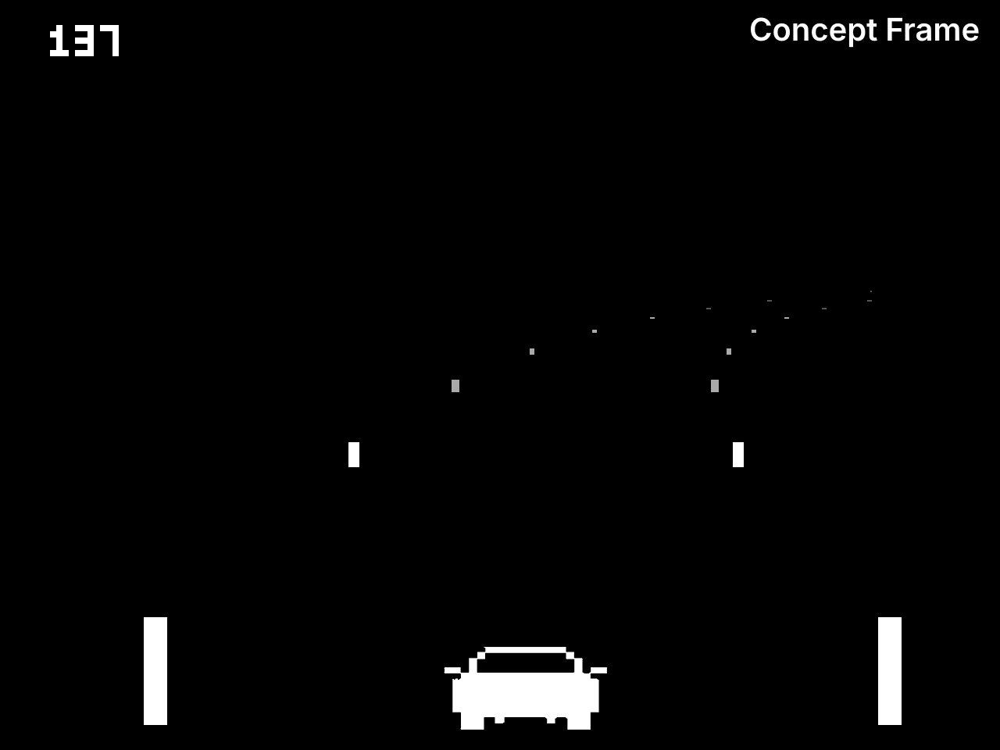
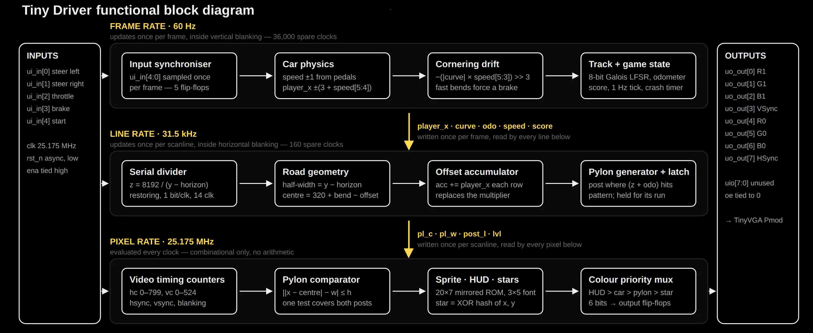
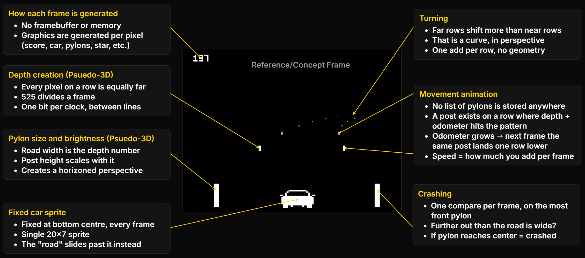

<!---

This file is used to generate your project datasheet. Please fill in the information below and delete any unused
sections.

You can also include images in this folder and reference them in the markdown. Each image must be less than
512 kb in size, and the combined size of all images must be less than 1 MB.
-->

# Project Proposal

## Statement of purpose

**Tiny Driver** is a pseudo-3D driving game inspired by Atari's Night Driver
implemented on a single Tiny Tapeout GF180nm tile. You steer a car
down an endless winding road between pylons, trying to get as far as
possible within a time limit. Five inputs, and VGA video signals out.

## System diagram

**Game Logic:** Steering slides the whole road one way; the bend in the track slides it the other. 
Playing the game is cancelling the two against each other so that the pylons stay centered. If 
either of the front most posts reaches the center, then a crash is flagged.

**Forward motion:** For any row, the chip asks if that row's depth plus the odometer land on the 
repeating pattern? If yes, a post is drawn there. The odometer counts distance travelled, so on 
the next frame it has grown slightly and the same post satisfies the test one row lower down the 
screen. Sixty times a second, that reads as the posts marching toward the player. So visualizing
speed is simply how much is added to the odometer each frame the entire forward motion system is 
one counter and one comparison.

**Psuedo 3D graphics:** The bend is one number and the player's lateral position is another; each row 
shifts sideways by them scaled by its own depth, so far rows swing a long way and near rows barely move. 
That is exactly what a curve looks like in perspective, for one add per row. See [Lou's Pseudo-3D Page](http://www.extentofthejam.com/pseudo/).

### Complete game state

| Value | Purpose |
| -------- | ----- |
| `odometer` | Distance travelled, 3 fractional bits |
| `speed` | 0–63, in ⅛ distance units per frame |
| `x position` | Lateral position |
| `curve` | Current bend, two's complement, −15…+15 |
| `lfsr` | Track generator, psuedo random generation using shift reg |
| `time` | Seconds remaining |
| `time div` | Frame counter producing the 1 Hz tick |
| `crash timer` | Crash hold timer |
| `score` | Three digits |
| `buttons` | Synchronised button inputs |

## I/O pin assignment table (Tiny Tapeout pins)

| Function | TT Pin Map | I/O |
| ---------------- | ----------- | --- |
| STEER_L | ui_in[0] | In -> steer left |
| STEER_R | ui_in[1] | In -> steer right |
| THROTTLE | ui_in[2] | In -> accelerate |
| BRAKE | ui_in[3] | In -> brake |
| START | ui_in[4] | In -> start / restart |
| - | ui_in[7:5] | In -> unused |
| R1 | uo_out[0] | Out <- red, high bit |
| G1 | uo_out[1] | Out <- green, high bit |
| B1 | uo_out[2] | Out <- blue, high bit |
| VSYNC | uo_out[3] | Out <- frame sync, active low |
| R0 | uo_out[4] | Out <- red, low bit |
| G0 | uo_out[5] | Out <- green, low bit |
| B0 | uo_out[6] | Out <- blue, low bit |
| HSYNC | uo_out[7] | Out <- line sync, active low |
| - | uio[7:0] | Unused; `uio_oe` (tied to 0) |
| CLK | clk | In -> 25.175 MHz |
| RST_N | rst_n | In -> asynchronous reset, active low |
| ENA | ena | In -> tied high by the harness |

## Proposed specification

| Specification | Target Value |
| ------------- | ------------ |
| Process | GF180MCU (gf180mcuD) |
| Die area | 1 tile, 160µm × 100µm |
| Clock | 25.175 MHz, single domain |
| Reset | `rst_n`, asynchronous, active low |
| Video output | 640 × 480 @ 60 Hz VGA |
| Colour depth | 6 bits, 2 per channel |
| Standard cells | < 1,800 |

## Timeline for completion

| Date | Deliverable |
| ---- | ----------- |
| Oct 15 | Video timing, road and pylon rendering correct in simulation; first cocotb tests passing. |
| Oct 22 | Game logic complete: physics, drift, crash, score. First full hardening to measure tile utilization / area. |
| Nov 5 | Feature freeze & Gate-level simulation against the same cocotb suite as the RTL. |
| Nov 15 | Post-layout verification |
| Nov 20 | Final GDS submitted with `info.yaml` and documentation |

## Who does what?

**Matthew Embaye:** Design | Architecture & RTL, divider and geometry, game logic and sprites.

**Yacine Ouhrouche:** Verification | Testing, cocotb suite, simulation, area and timing review.

**Both:** Documentation, `info.yaml`, final submission.

## References

- Tiny Tapeout — VGA Pmod and clock specifications: [https://tinytapeout.com/specs/clock/](https://tinytapeout.com/specs/clock/)
- TinyVGA Pmod pinout: [https://github.com/mole99/tiny-vga](https://github.com/mole99/tiny-vga)
- VGA 640×480 @ 60 Hz timing: [http://tinyvga.com/vga-timing/640x480@60Hz](http://tinyvga.com/vga-timing/640x480@60Hz)
- GF180MCU open PDK: [https://gf180mcu-pdk.readthedocs.io/](https://gf180mcu-pdk.readthedocs.io/)
- Atari *Night Driver* (1976), the original of this genre: [https://en.wikipedia.org/wiki/Night_Driver_(video_game)](https://en.wikipedia.org/wiki/Night_Driver_(video_game))
- Lou's Pseudo-3D Page — the row-based perspective projection this design uses:
  [http://www.extentofthejam.com/pseudo/](http://www.extentofthejam.com/pseudo/)
